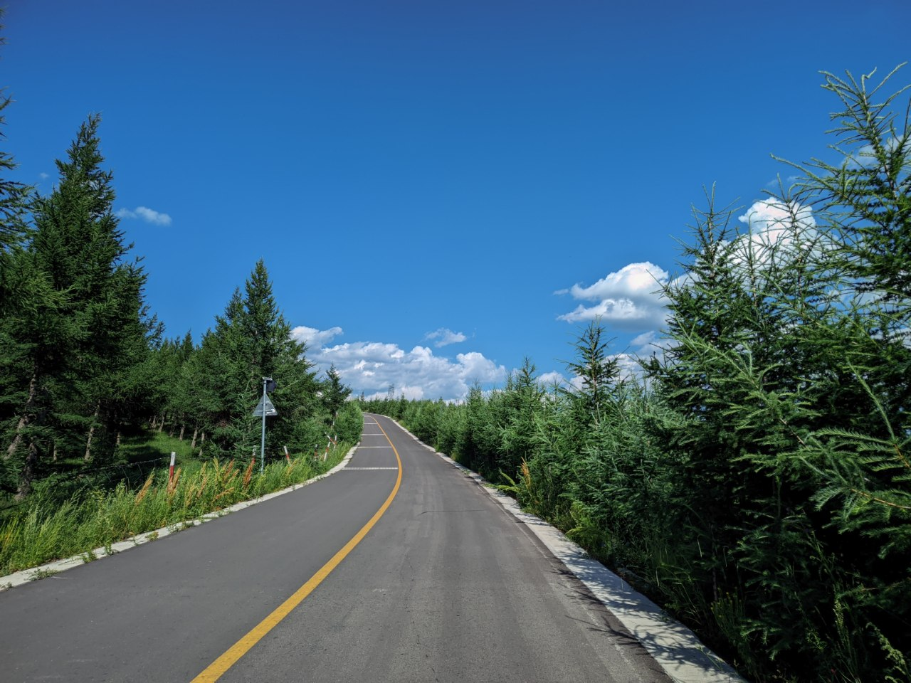
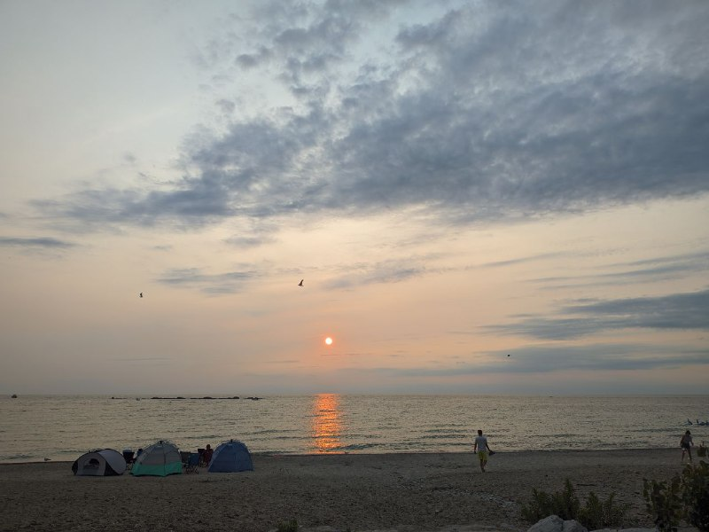
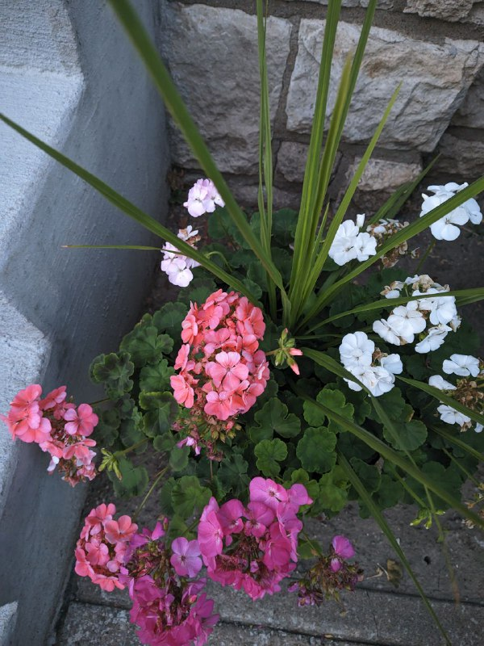

<h1 align="left">Config for AGC GCAM: Motorola RWTO

</h1> 

All Versions of RTWO are supported.

<h2>Latest Release</h2>

* [Latest APK: AGC9.2.14_V11.0](https://www.celsoazevedo.com/files/android/google-camera/dev-BigKaka/f/dl70/)
* [Config: Latest Release](https://github.com/d-solis/rtwo-agc-conf/releases/latest/)

<h2>Known Bugs</h2>

* HDR Enhanced causes crashes no matter selected lens (temp fix: just use hdrnet)
* Enabling Auto Lens selection causes crash
* Slow-Mo just doesnt work | GCAM on rtwo related issue

<h2>Credits</h2>

* Jason W (Color Profiles)
* The creator of Thinkphone.agc (No name/username was given)
* GSMARENA (helping find devices with similar sensors)
* Me (Tweaking noise models of the ultrawide, telephoto, and frontfacing camera, manually tweaking libraries, curves, and lenses)

<h2>Gallery</h2>

<table align="center">
  <tr>
    <td align="center">
      
       
      <em>@Doge | rtwo3 | 1.0</em>
    </td>
  </tr>
</table>
<table align="center">
  <tr>
    <td align="center">
      
       
      <em>@CanDroid | rtwo.3.1 | 1.0</em>
    </td>
  </tr>
</table>
<table align="center">
  <tr>
    <td align="center">
      
       
      <em>@d-solis | rtwo3.1 | 1.0</em>
    </td>
  </tr>
</table>

<h3 align="center">
Thanks for stopping by!
</h3>
